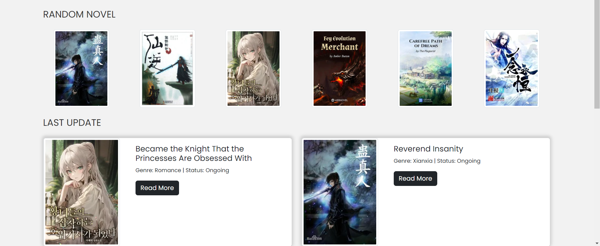
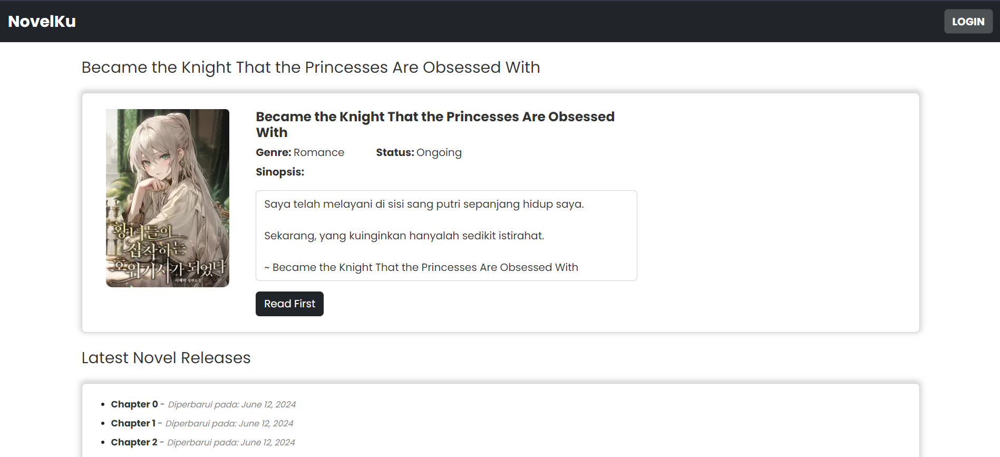
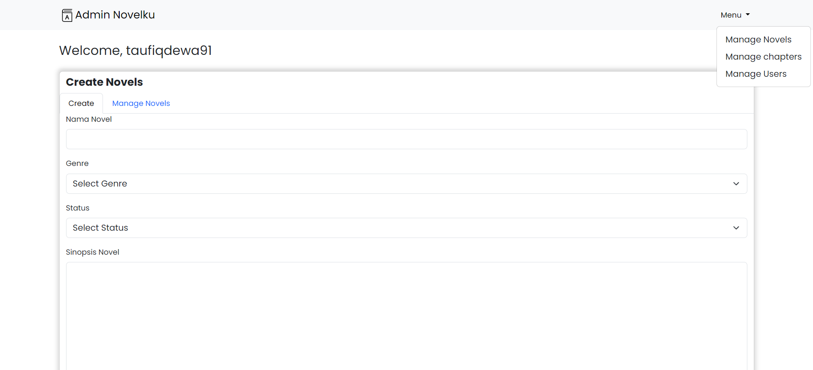

# **Web Novel Novelku Documentation**

## **Project Overview**
The Web Novel Website is built using the Laravel framework. The platform allows users to read web novels whereas admins can upload and manage novels. It provides a simple interface. The site has a responsive design for both mobile and desktop users.

## **Key Features**
- **User Authentication**: Secure login and registration for admin.
- **Novel Management**: Admin can create, update, and delete their novels, including features like categorizing by genre and adding chapters.
- **Responsive Design**: The website is fully responsive and works seamlessly on both mobile devices and desktops.
- **Admin Dashboard**: Admins can manage users, novels.
  
## **Technology Stack**
- **Frontend**: Blade Templates, Bootstrap, CSS
- **Backend**: Laravel 10, PHP 8.x
- **Database**: MySQL
- **Version Control**: Git
- **Other**: Composer

## **Installation and Setup**
1. **Clone the repository**:
   ```bash
   git clone https://github.com/taufiq-azr/lara-novelku.git
   cd lara-novelku
   ```
2. **Install dependencies**:
   ```bash
   composer install
   npm install && npm run dev
   ```
3. **Create `.env` file**:
   Copy the `.env.example` file to `.env` and update the environment variables:
   ```bash
   cp .env.example .env
   ```
4. **Generate application key**:
   ```bash
   php artisan key:generate
   ```
5. **Set up the database**:
   Create a database and update the `.env` file with your database credentials:
   ```bash
   DB_CONNECTION=mysql
   DB_HOST=127.0.0.1
   DB_PORT=3306
   DB_DATABASE=DB_DATABASE=novelku_database
   DB_USERNAME=root
   DB_PASSWORD=
   ```
6. **Run migrations**:
   ```bash
   php artisan migrate
   ```
7. **Start the development server**:
   ```bash
   php artisan serve
   ```

## **Usage**
- **Login**: Visit the `/login` page to login for admin.
- **Browsing Novels**: After logging in, users can browse available novels.
- **Adding New Novels** (for admin): Navigate to the "Admin" page under the author's dashboard to add a new novel.

## **Screenshots**

### 1. **Homepage**  
   

   The homepage provides a list of the latest novels and user recommendations.

### 2. **Novel Details Page**  
   

   This page shows the details of a selected novel, including the Genre, Status, and available chapters.

### 3. **Admin Dashboard**  
   

   Admin can manage their novels, view feedback from readers, and publish new chapters from this dashboard.

## **Code Structure**
- **Models**: Located in `app/Models`, these include models like `Novels`, `Chapters`, `Users`.
- **Controllers**: Located in `app/Http/Controllers`, these handle requests such as `NovelController`, `UserController` etc.
- **Routes**: Defined in `routes/web.php`, these include all the routes for web navigation.

## **Contributing**
If you'd like to contribute to the project:
1. Fork the repository.
2. Create a new feature branch (`git checkout -b feature/feature-name`).
3. Commit your changes (`git commit -m "Add new feature"`).
4. Push to the branch (`git push origin feature/feature-name`).
5. Open a pull request.
